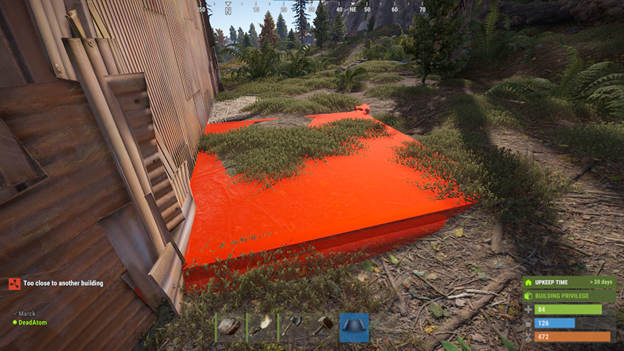
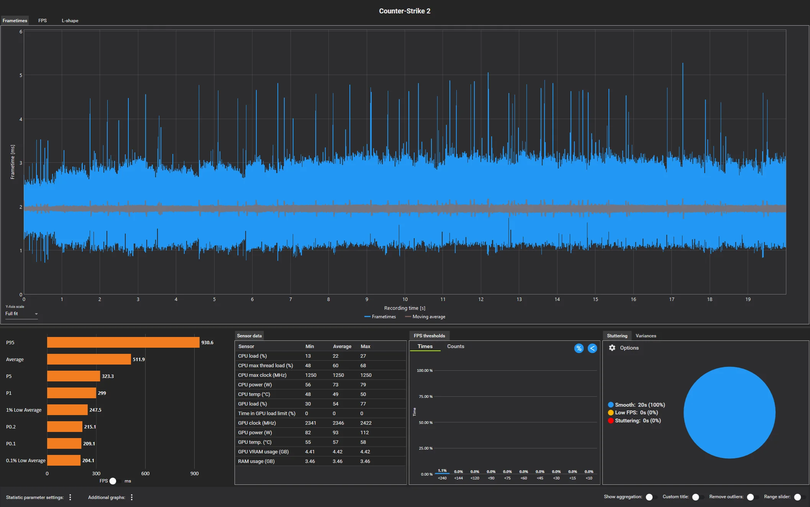

# Отчёт по тестированию ПО - Игра «Rust»

## 1. Введение
**Цель работы:** Провести системное тестирование многопользовательской игры «Rust» для проверки корректности работы базовых механик выживания, строительства, графического интерфейса, а также оценки производительности клиента игры при высоких нагрузках.

**Краткое описание программы:** Rust - это многопользовательская компьютерная игра в жанре симулятора выживания. Игроки появляются в процедурно-генерируемом открытом мире без экипировки. Для выживания необходимо добывать ресурсы, создавать инструменты и оружие, строить защищенные базы и взаимодействовать с другими игроками и PvE-угрозами.

**Обоснование тестирования:** Системное тестирование необходимо для оценки стабильности игры с точки зрения конечного пользователя. Учитывая специфику игры, критически важно проверить физику строительства, удобство инвентаря и поведение клиента при рендеринге большого количества объектов.

## 2. Тест-план 

### 2.1 Цели и задачи
1. **Функциональное тестирование:** Проверка механик добычи ресурсов, системы крафта и логики установки строительных блоков.
2. **Тестирование GUI:** Проверка корректности отображения инвентаря, шкалы здоровья/голода/жажды и меню крафта.
3. **Тестирование производительности:** Проверка стабильности частоты кадров при подгрузке крупных пользовательских построек (баз).
4. Выявление багов и их документирование.

### 2.2 Область применения
* Модуль выживания и крафта
* Модуль строительства 
* Модуль графического интерфейса
* Модуль рендеринга и производительности

**Ограничения:** Тестирование проводится на ПК-версии в клиенте Steam. 
### 2.3 Стратегия тестирования
1.  Функциональное тестирование основных механик 
2.  GUI тестирование
3.  Нагрузочное тестирование клиента / Тестирование производительности реакция движка на спавн множества объектов в одном чанке.

### 2.4 Критерии начала тестирования
* Игра успешно запускается через Steam без критических ошибок.
* Персонаж успешно подключается к тестовому серверу и появляется на карте.

### 2.5 Критерии завершения тестирования
* Выполнены все подготовленные тест-кейсы.
* Зарегистрированы баг-репорты для всех неудачных сценариев.

### 2.6 Тестовая среда
* **ОС:** Windows 10 Pro (64-bit)
* **Железо:** AMD Ryzen 5 5600X, 16GB RAM, NVIDIA RTX 5060 ti.
* **Дополнительно:** Локальный тестовый сервер (пинг < 10 мс), внутриигровая консоль (F1) для мониторинга FPS.

## 3. Наборы тестов 

* **Test Suite 1: Функциональность**
    * TC-01 Добыча ресурса базовым инструментом.
    * TC-02 Крафт спального мешка.
    * TC-03 Установка фундамента в текстуру скалы.
* **Test Suite 2: Графический интерфейс**
    * TC-04 Отображение дебаффа радиации.
    * TC-05 Перемещение предметов в инвентаре.
* **Test Suite 3: Производительность**
    * TC-06 Загрузка и рендеринг высоконагруженного чанка.

### 4. Тест-кейсы (Test Cases)

| ID | Название | Шаги | Тестовые данные | Ожидаемый результат | Фактический результат | Статус |
| :--- | :--- | :--- | :--- | :--- | :--- | :--- |
| **TC-01** | Добыча ресурса | 1. Подойти к дереву. 2. Ударить по стволу камнем 5 раз. | Инструмент: Камень | В инвентарь добавляется ресурс «Дерево» за каждый удар. | Ресурс корректно добавляется. | Pass |
| **TC-02** | Крафт предмета | 1. Собрать 30 ткани. 2. Открыть меню крафта (Q). 3. Выбрать «Спальный мешок» и нажать Craft. | 30 Ткани | Через 30 секунд в инвентаре появляется спальный мешок. | Мешок создан, ткань списана. | Pass |
| **TC-03** | Установка фундамента у скалы | 1. Взять план строительства. 2. Выбрать «Квадратный фундамент». 3. Попытаться установить его наполовину внутрь текстуры скалы. | План строительства, 50 Дерева | Блок подсвечивается красным (установка невозможна из-за коллизии с рельефом). | Блок светится синим и устанавливается прямо внутри текстуры камня. | **Fail** |
| **TC-04** | Дебафф радиации (GUI) | 1. Забежать в Радиационную зону (РТ) без защитной одежды. | Локация: Airfield | На экране появляется счетчик Гейгера, индикатор заражения и слышен треск. | Индикаторы и звук работают корректно. | Pass |
| **TC-05** | Перемещение лута (GUI) | 1. Открыть деревянный ящик. 2. Перетащить предмет из инвентаря в ящик мышью. | Деревянный ящик, любой предмет | Предмет плавно перемещается в новый слот без визуальных багов. | Перемещение работает корректно. | Pass |
| **TC-06** | Подгрузка крупной базы | 1. Включить мониторинг FPS (F1 -> perf 1). 2. Быстро приблизиться к масштабной базе. | База на 500+ обьектов | FPS остается стабильным, подгрузка объектов плавная. | Происходит резкий фриз на 2-3 секунды, FPS падает до 15, затем восстанавливается. | **Fail** |

## 5. Баг-репорты (Bug Reports)

| ID | Название | Шаги воспроизведения | Ожидаемый результат | Фактический результат | Приоритет | Серьезность | Статус | Вложение |
| :--- | :--- | :--- | :--- | :--- | :--- | :--- | :--- | :--- |
| **BUG-01** | Игнорирование коллизий рельефа при строительстве | 1. Взять план строительства. 2. Подойти к отвесной скале. 3. Установить фундамент впритык. | Движок должен запрещать установку строительных блоков внутри непроницаемых текстур карты (скал). | Фундамент ставится внутри скалы. Это позволяет игрокам прятать лут внутри текстур. | High | Critical | Open |  |
| **BUG-02** | Резкое падение FPS при рендеринге крупных построек | 1. Построить или найти базу из 500+ элементов. 2. Выйти из зоны прорисовки. 3. Резко вернуться в зону прорисовки на транспорте (миникоптер). | Плавная потоковая подгрузка объектов, сохранение играбельного FPS. | Микрофриз клиента на 2-3 секунды и падение кадров из-за синхронной загрузки геометрии зданий. | Medium | Major | Open |  |

---

## 6. Отчёт о результатах

| Всего тестов | Пройдено (Pass) | Провалено (Fail) | Найдено багов | Процент успеха |
| :--- | :--- | :--- | :--- | :--- |
| 6 | 4 | 2 | 2 | 66.6% |

## 7. Вывод
В ходе системного тестирования игры **Rust** были проверены функциональные механики выживания, графический интерфейс пользователя и производительность клиента. 
* **Базовые механики** работают исправно и интуитивно понятно.
* Была выявлена **критическая уязвимость в физике строительства** (BUG-01), позволяющая игрокам злоупотреблять текстурами карты для скрытия объектов. 
* Дополнительный **тест на производительность** выявил проблему оптимизации (BUG-02): движок игры испытывает трудности с плавным рендерингом высоконагруженных чанков, что приводит к кратковременным зависаниям при исследовании карты. 

**Рекомендации:** Необходимо настроить более строгие хитбоксы для процедурно-генерируемых скал и оптимизировать систему Level of Detail (LOD) для пользовательских построек.
